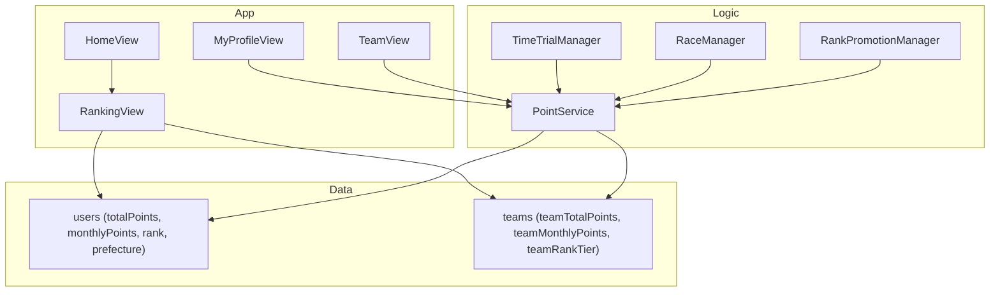

## ランキング・バッジ機能 全体方針

- **ポイント軸の統一**: 既存のタイムトライアルポイント、今後のEKIDENポイントなどを「TASUKIポイント」として統一し、ユーザーとチームに累計・月間ポイントを持たせる。
- **評価期間**: 個人・チームともに **累計ランキング** と **月間ランキング** の2種類を提供し、画面上のタブで切替可能にする。
- **可視化要素**: プロフィールやチーム画面に、ポイントに応じたバッジ（色・ティア）を表示し、ランキング画面では順位リスト＋自分/自チームの位置をハイライトする。

## 1. データモデル設計

- **ユーザー（`users` コレクション）拡張**
  - 追加フィールド案:
    - `totalPoints: Int` … 生涯獲得TASUKIポイント
    - `monthlyPoints: Int` … 当月獲得ポイント（毎月リセット or ローテーション）
    - （既存）`rank` や `prefecture` をランキング絞り込み条件に再利用
  - Firestore インデックス前提:
    - `totalPoints` 降順でクエリ
    - `monthlyPoints` 降順でクエリ
    - `rankTier + totalPoints` / `prefecture + totalPoints` など複合インデックス
- **ポイントバッジ定義（コードのみ）**
  - `PointBadge` のような enum/struct を定義:
    - ティア例: Bronze / Silver / Gold / Platinum / Diamond
    - しきい値例（累計ポイント）:
      - Bronze: 1,000+
      - Silver: 5,000+
      - Gold: 10,000+
      - Platinum: 25,000+
      - Diamond: 50,000+
    - `badge(forTotalPoints:) -> PointBadge?` ヘルパーで算出
- **EKIDEN チームモデル拡張**
  - チームドキュメント（既存の team / ekidenTeams コレクション）に追加:
    - `teamTotalPoints: Int` … 生涯チームポイント
    - `teamMonthlyPoints: Int` … 月間チームポイント
    - `teamRankTier: String` … S〜E などのチームランク文字列（Team S / A / ...）
    - `prefecture` または地域情報（既にあれば流用）
  - ランク算出ロジック:
    - レース結果によるポイント（後述）から `teamTotalPoints` を更新
    - しきい値で `teamRankTier` を更新（例: 500 / 2000 / 5000 / 10000 など）

## 2. ポイント付与ルール

- **個人ポイント（ユーザー）**
  - 既存のタイムトライアル:
    - `TimeTrialPoints.points(forRank:)` を **ユーザーの `totalPoints` / `monthlyPoints` に加算**
    - シーズン性をつけたい場合は、別フィールド `seasonPoints` を後から追加可能
  - 将来の拡張フックを用意:
    - 練習会参加 / 継続ログイン / パートナー継続 なども同じポイントAPIで加算できる形に抽象化
    - 例: `PointService.addPoints(userId: String, amount: Int, reason: PointReason)`
- **EKIDEN チームポイント**
  - レース単位でのスコア計算ルール例:
    - チーム順位ポイント（例）:
      - 1位: 500pt, 2位: 400pt, 3位: 320pt, 4位以下は逓減
    - 完走ボーナス: 区間DNFなしで +100pt
    - 参加ボーナス: 出走チーム全てに +50pt
  - 付与タイミング:
    - `RaceView` / `RaceManager` のレース完了時に、所属チームの `teamTotalPoints` / `teamMonthlyPoints` を更新
    - 更新後に `teamRankTier` を昇格のみロジックで更新

## 3. バッジ表示（個人・チーム）

- **個人プロフィール (`MyProfileView`, `UserProfileDetailView` など)**
  - `@AppStorage("myRank")` 等と同様に、`myTotalPoints` を読み込み（なければ 0）。
  - `PointBadge` に基づくバッジアイコンを名前 or ランクの近くに表示:
    - 例: 名前右側に小さなメダルアイコン＋ティア名ラベル
  - 他人プロフィール表示 (`FindView` のカードなど) にも同じバッジを表示して一貫性を持たせる。
- **チームビュー (`TeamView`, `TeamDetailView`)**
  - チーム名の近くに `teamRankTier` とバッジ（Team S〜E に応じた色やアイコン）を表示。
  - チーム詳細には `teamTotalPoints`, `teamMonthlyPoints` を簡易に表示（バー・数値）。

## 4. 個人ランキング画面設計

- **新規 `RankingView`（個人用）**
  - アクセス導線:
    - `HomeView` の TOTAL POINTS 付近に「ランキング」ボタン
    - もしくはタブバーか `MyProfileView` から遷移
  - UI構成:
    - 上部セグメント: `個人 / チーム`（チームランキングと切り替え）
    - 個人タブ内のサブセグメント:
      - `累計` / `月間`
      - フィルター: `全体`, `ランク別`, `地域別`
    - リスト:
      - 順位, 名前, バッジ, ランク, 地域, ポイント表示
      - 自分の行は背景ハイライト
- **クエリ戦略**
  - 全体ランキング（上位 N 人）:
    - `users` を `orderBy(totalPoints, descending: true).limit(to: 100)` など
  - ランク別ランキング:
    - `where rankTier == "A"` など＋ `orderBy(totalPoints, descending: true)`
  - 地域別ランキング:
    - `where prefecture == myPrefecture` など＋ `orderBy(totalPoints, descending: true)`
  - 月間ランキングは `monthlyPoints` に同様のクエリを適用
- **自分の順位の取得方法**
  - 上位 N だけでは自分が入らないことがあるため、次のいずれかを検討:
    - a) 上位 100 + 自分周辺 20件を別クエリで取得し、リスト中ほどに「自分の位置」ブロックを表示
    - b) 初期はシンプルに上位 100 のみ表示し、詳細な順位は後回し

## 5. EKIDEN チームランキング画面設計

- `**TeamRankingView`（または `RankingView` 内のチームタブ）**
  - サブセグメント:
    - `累計` / `月間`
    - フィルター: `全体`, `チームランク別`, `地域別`
  - リスト:
    - チーム名, チームランクバッジ, 地域, メンバー数, ポイント
    - 自チームがある場合はハイライト
- **クエリ戦略**
  - 全体: `orderBy(teamTotalPoints, descending: true).limit(to: 100)`
  - チームランク別: `where teamRankTier == "Team A"` など
  - 地域別: `where prefecture == myPrefecture` など

## 6. 月次リセットと集計運用

- **月間ポイントの扱い**
  - シンプルな案:
    - アプリ起動時、当月かどうかを `UserDefaults` / Firestore 上の `monthlyPointsMonth` でチェック
    - 月が変わっていたら `monthlyPoints` を 0 にリセット（ユーザー / チームともに）
  - 本格運用を想定するなら:
    - Cloud Functions などで月初にバッチリセット
    - ただし初期実装はアプリ側の「最初のアクセス時リセット」で十分

## 7. 既存実装との接続ポイント

- **ポイント加算の接続先**
  - タイムトライアル:
    - `TimeTrialManager.fetchRanking` で `TimeTrialPoints` を使っている箇所から、ユーザードキュメントの `totalPoints` / `monthlyPoints` を更新する処理を追加
  - EKIDEN レース:
    - `RaceManager` / `RaceView` のレース完了時に、所属チームと各メンバーへのポイント加算フックを挿入
- **バッジ・ランキング画面への接続先**
  - `MyProfileView` / `UserProfileDetailView`:
    - ポイントバッジ表示を追加
  - `TeamView` / `TeamDetailView`:
    - チームランク＋チームバッジ表示を追加
  - `HomeView`:
    - TOTAL POINTS 近辺にランキング画面への導線ボタン

## 8. 実装ステップの優先度（最小構成 → 拡張）

1. **データモデルの拡張**
  - ユーザー/チームに `totalPoints`, `monthlyPoints`, `teamRankTier` などのフィールドを定義（コード側＋Firestoreスキーマ想定）
  - `PointBadge` とチームランクのしきい値を決める。
2. **ポイント加算の導線実装**
  - タイムトライアル完了時にユーザーポイントを更新。
  - EKIDENレース完了時にチームポイントを更新。
3. **バッジ表示の追加**
  - 個人プロフィールとチームビューにバッジ・ランク表示を追加。
4. **個人ランキング画面の追加**
  - `RankingView` を実装し、累計/月間・ランク別/地域別フィルタでユーザーランキングを表示。
5. **チームランキング画面の追加**
  - チームタブを実装し、チームランキング（累計/月間・ランク別/地域別）を表示。
6. **月間ポイントのリセットロジック**
  - 月跨ぎ検知と `monthlyPoints` リセット処理を入れる。

## 9. 簡易アーキテクチャ図

